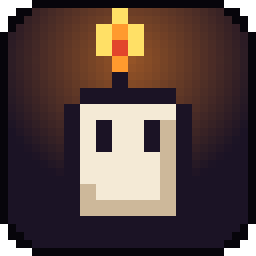

<h1 align="center">PAVIO</h1>

<b>Você é uma velinha numa masmorra. Sua chama é a sua vida e o seu tempo: quando ela apaga, acabou. 🕯️</b>

---

## 📥 Instalar

1. Baixe o **`PAVIO-Setup-<versão>.exe`** em **[Releases](../../releases/latest)**.
2. Abra o instalador e escolha a pasta (ou deixe a padrão).
3. Jogue pelo atalho **PAVIO** na área de trabalho ou no menu Iniciar.

> Na primeira vez, o Windows pode mostrar **"O Windows protegeu o computador"**. Clique em **Mais informações → Executar assim mesmo**.

**Requisitos:** Windows 10 ou 11 (64 bits) e 300 MB livres.
**Não precisa de internet** pra jogar.

## 🎮 O jogo

- **Roguelite de bala e cera**, no estilo Binding of Isaac e Enter the Gungeon: masmorras geradas a cada partida, salas, chefes e muita bala na tela.
- **A chama é a vida e o relógio:** ela queima sozinha. Cera, castiçais e itens mantêm você acesa.
- **Mais de 600 itens** que se combinam em **sinergias** e **transformações**, **100 itens ativos** e **70 armas** em 6 tiers, incluindo a **TETE**, um pug que atira latidos, e as gatas **NIX** e **YUUMI**.
- **3 finais**, um chefe secreto, capítulos que mudam as regras e o modo infinito.
- **A Sacristia:** ande com a sua vela entre as partidas, troque de personagem, teste a arma no boneco e desça pelo portal.
- **Personagens para liberar**, cada um com arma, itens e atributos próprios.
- **Desafios, maldições de andar, Forja (funde duas armas), Cassino, familiares** e **skins** por maestria das armas.
- **Armaria 3D:** gire e teste todas as armas.
- **Desafio diário** e **sementes** para jogar a mesma masmorra que um amigo.
- **Jogar em dupla** no mesmo PC (teclado ou controle).

## ⌨️ Controles principais

| Tecla | Ação |
|---|---|
| `W A S D` | andar |
| `Mouse` · `Clique` | mirar · atirar |
| `Espaço` | esquiva |
| `Clique direito` ou `F` | parry (rebate as balas) |
| `E` | interagir · pegar |
| `R` · `Q` · `1`–`3` | recarregar · trocar de arma · escolher a arma |
| `C` | item ativo |
| `P` ou `Esc` | pausa |
| `F11` | tela cheia |

---

Um jogo da <b>WW STUDIOS</b> · criado por <b>Luiz Vargas</b> Créditos e licenças em <a href="CREDITOS.md">CREDITOS.md</a>

